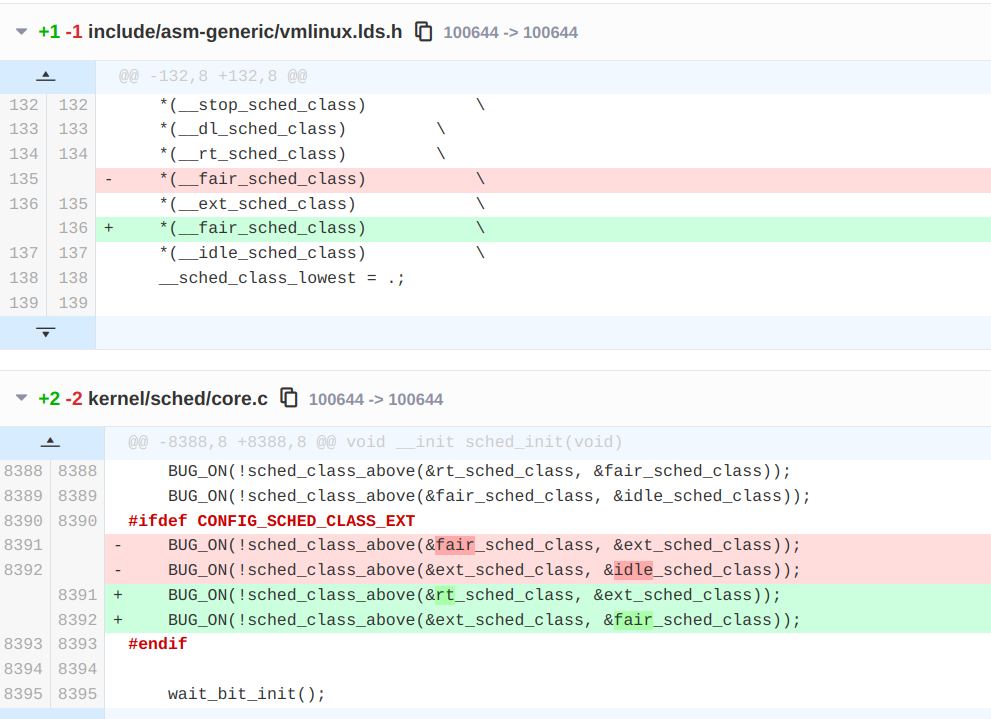
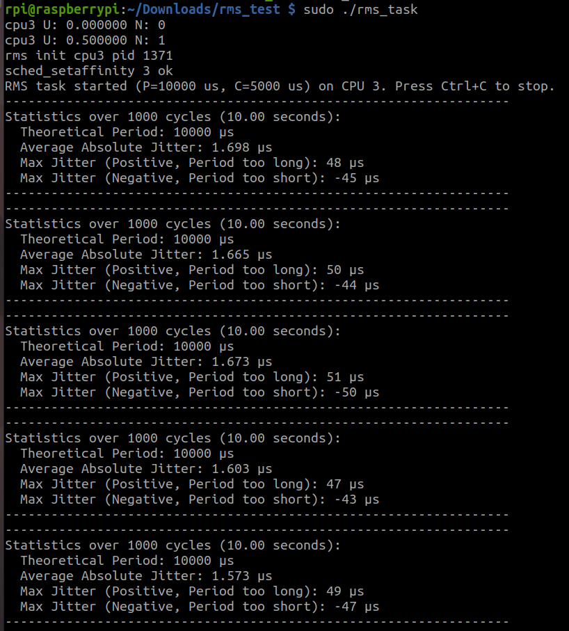
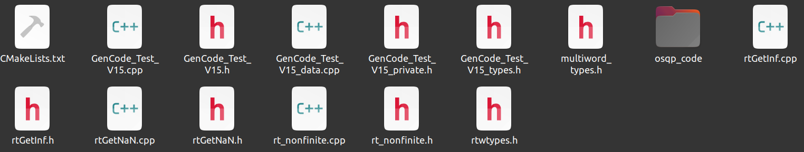
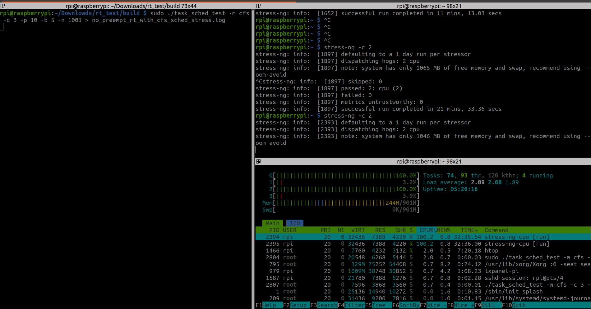
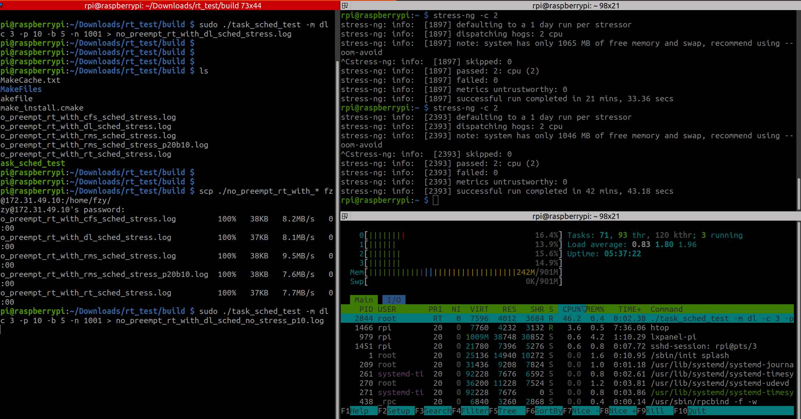
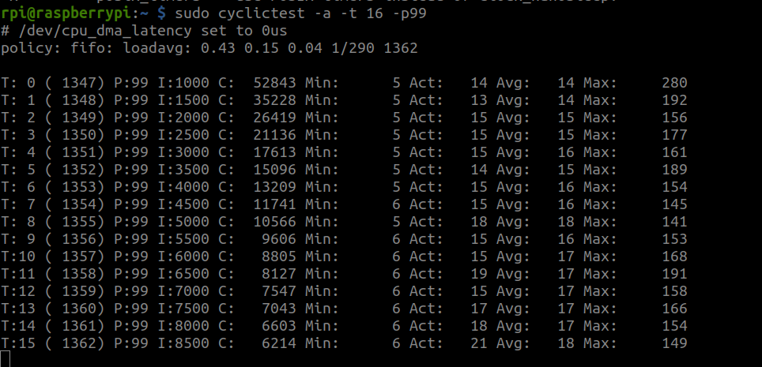
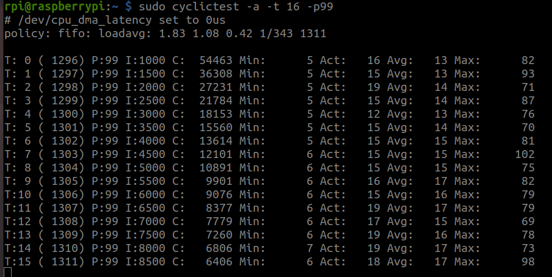
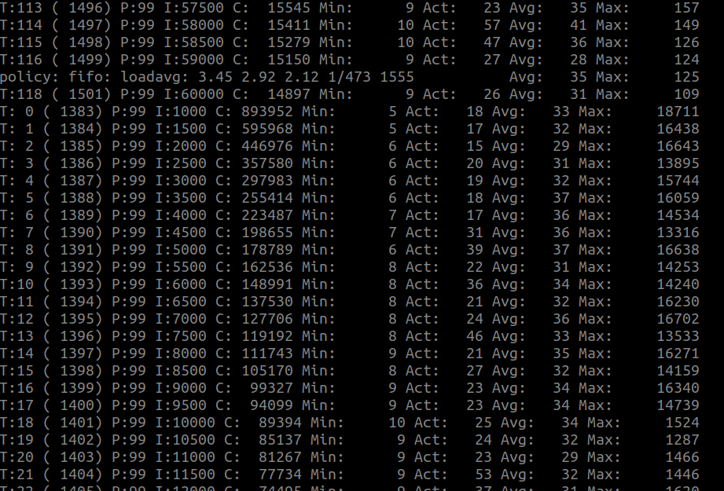
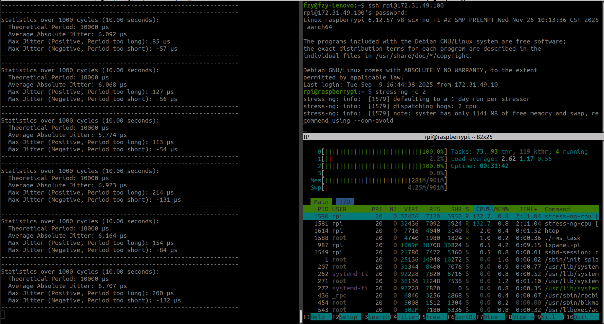

# Sched_ext  在汽车异构计算中实时性提高的探索

## 1. 什么是 sched_ext（scx）？

## 2. 如何搭建scx运行环境


打上实时补丁,补丁地址下载如下，补丁包需与内核版本号一致：

```bash
# 内核代码
https://github.com/raspberrypi/linux
# 补丁包
https://mirrors.edge.kernel.org/pub/linux/kernel/projects/rt/6.12/
# aliyun mirrors
https://mirrors.aliyun.com/linux-kernel/projects/rt/6.12/?spm=a2c6h.25603864.0.0.51aab584MPNDiQ
```


配置内核，打开 SCHED_CLASS_EXT等相关配置项

```bash
CONFIG_BPF_JIT=y
CONFIG_BPF_SYSCALL=y
# CONFIG_DEBUG_INFO_REDUCED is not set
CONFIG_DEBUG_INFO_BTF=y
CONFIG_SCHED_CLASS_EXT=y
CONFIG_FTRACE=y
CONFIG_BPF_EVENTS=y

# 以下选择开启
CONFIG_BPF_JIT_ALWAYS_ON=y
CONFIG_BPF_JIT_DEFAULT_ON=y
CONFIG_PAHOLE_HAS_SPLIT_BTF=y
CONFIG_PAHOLE_HAS_BTF_TAG=y
```

menuconfig 配置如下：


调整调度器顺序

为什么不用sched_deadline？

sched_ext机制的RMS调度在任务优先级、负载分配等方面由BPF程序控制，但实际抢占能力仍依赖Linux内核当前的抢占模式，以及PREEMPT_RT补丁的支持情况。对比sched_deadline，RMS在我们的应用场景中，主要在**任务可预测性、对周期任务的处理顺序、以及CPU占用上限控制方面**体现优势。此外在特定模块中，可通过RMS的统一配置与监控，简化调度策略调整。


**sched_ext优先级比cfs要低，不修改内核调整的话并不适合实时任务？**


下面这段代码，定义了调度器在内核中的优先级顺序。内核的主调度函数（`schedule()`）在选择下一个运行进程时，会遍历这个数组，按照顺序检查每个调度类别是否有可运行的进程。

如果不改变调度器的优先级的话，sched_ext在fair的下面，其优先级会低于 CFS（完全公平调度器）所管理的**所有普通进程**。那么以实时性增强为目的的sched_ext调度器，将无法实现目标中的实时性。只要fair中还有可运行的进程，调度器都会去选定一个fair进程运行。

放在rt或者deadline之上，会有比较大的风险，需要谨慎处理。

最合理的方式，是将ext_sched调整到了rt和fair（EEVDF）之间的位置。如下：

```c
// include/asm-generic/vmlinux.lds.h
/*
 * The order of the sched class addresses are important, as they are
 * used to determine the order of the priority of each sched class in
 * relation to each other.
 */
#define SCHED_DATA				\
	STRUCT_ALIGN();				\
	__sched_class_highest = .;		\
	*(__stop_sched_class)			\
	*(__dl_sched_class)			\
	*(__rt_sched_class)			\
	*(__fair_sched_class)			\
	*(__ext_sched_class)			\
	*(__idle_sched_class)			\
	__sched_class_lowest = .;
// 修改后
#define SCHED_DATA				\
	STRUCT_ALIGN();				\
	__sched_class_highest = .;		\
	*(__stop_sched_class)			\
	*(__dl_sched_class)			\
	*(__rt_sched_class)			\
	*(__ext_sched_class)			\   // 上移
	*(__fair_sched_class)			\
	*(__idle_sched_class)			\
	__sched_class_lowest = .;
```


编译arm64内核时报错：

在Linux内核源代码中调整这些后，编译arm64的内核时，报错 `arch/arm64/kernel/vdso/vdso.lds:184 syntax error`

原因：

莫名其妙，注意不要在`#define SCHED_DATA`的上方加注释，不然也会报这个错误。

在 `*(__ext_sched_class)` 之后的 `\` 后面，可能插入了：

- **全角空格** (`\u3000`)
- **非打印控制字符**
- **其他非法 Unicode 字符**


同步的，也修改一下调度器优先级关系的检查（断言），确认内核调度器类的优先级顺序是正确的。如下：

```c
// kernel/sched/core.c	
/* Make sure the linker didn't screw up */
#ifdef CONFIG_SMP
	BUG_ON(!sched_class_above(&stop_sched_class, &dl_sched_class));
#endif
	BUG_ON(!sched_class_above(&dl_sched_class, &rt_sched_class));
	BUG_ON(!sched_class_above(&rt_sched_class, &fair_sched_class));
	BUG_ON(!sched_class_above(&fair_sched_class, &idle_sched_class));
#ifdef CONFIG_SCHED_CLASS_EXT
	BUG_ON(!sched_class_above(&fair_sched_class, &ext_sched_class));
	BUG_ON(!sched_class_above(&ext_sched_class, &idle_sched_class));
#endif
// 修改后
// rt在ext的上面，ext在fair的上面
#ifdef CONFIG_SCHED_CLASS_EXT
	BUG_ON(!sched_class_above(&rt_sched_class, &ext_sched_class));
	BUG_ON(!sched_class_above(&ext_sched_class, &fair_sched_class));
#endif
```





周期性定时器:对于 linux上保证定时周期可预测，你们是怎么解决的？

将Linux内核转换为完全可抢占模式（PREEMPT_RT），并采用高精度定时器（hrtimer）在内核态驱动任务周期。这套方案将Linux系统的行为从“尽力而为”转变为提供高度确定性的时限保障，从而构建了一个从定时触发到任务执行的、高度可预测的调度闭环，使得基于sched_ext实现的RMS调度器能够为周期性任务提供可预测的定时保障。


交叉编译内核

部署内核、设备树文件

非实时内核：

```bash
rpi@raspberrypi:~/opt/bin $ uname -a
Linux raspberrypi 6.12.54-v8-fzy-sched+ #2 SMP PREEMPT Fri Nov  7 11:30:16 CST 2025 aarch64 GNU/Linux
```

打入preempt-rt patch的实时内核：

```bash
rpi@raspberrypi:~/Downloads/scx/scx/build/scheds/c $ uname -a
Linux raspberrypi 6.12.57-rt14-v8-scx-rt #2 SMP PREEMPT_RT Fri Nov 14 13:51:45 CST 2025 aarch64 GNU/Linux
```


scx编译安装至~/opt/bin

```bash
rpi@raspberrypi:~/opt/bin $ ls
scx_central  scx_flatcg  scx_nest  scx_pair  scx_prev  scx_qmap  scx_sdt  scx_simple  scx_userland
```

修改APT仓库至国内镜像，不然下载安装软件会很慢

安装bpftool

```bash
sudo apt install bpftool
```


运行scx_simple测试

```bash
rpi@raspberrypi:~/opt/bin $ sudo ./scx_simple 
libbpf: struct_ops simple_ops: member priv not found in kernel, skipping it as it's set to zero
local=4 global=0
local=46 global=24
local=78 global=40
local=171 global=77
local=212 global=96
local=243 global=110
local=274 global=124
local=308 global=139
local=346 global=156
local=437 global=192
local=470 global=207
local=505 global=222
^CEXIT: unregistered from user space
```

 `member priv not found in kernel`原因是当前的vmlinux是6.16的，而rpi上编译的内核是6.12，在6.16中加入了priv的内部使用变量。这不影响。

```c
// kernel/sched/ext.c
struct sched_ext_ops {
    // ...
    /* internal use only, must be NULL */
	void *priv;
}
```


## 3. 运行用户态实时调度器演示

RMS 周期调度

```c
// 示例程序 rms_task.c
#include <stdio.h>
#include <unistd.h>
#include <sched.h>
#include <signal.h>
#include <stdlib.h>
#include "librms.h"

static volatile int exit_req;

static void sigint_handler(int sig) {
    exit_req = 1;
}

int main() {
    int cpu = 3;
    unsigned long budget =  5UL * 1000UL * 1000UL;
    unsigned long period = 10UL * 1000UL * 1000UL;

    signal(SIGINT, sigint_handler); 

    // 绑定到CPU3，设置预算5ms，周期10ms
    if (sched_rms(cpu, budget, period) != 0) {
        printf("sched_rms failed\n");
        exit(EXIT_FAILURE);
    }

    while(!exit_req) {
        printf("Running task...\n");
        // TASK
        sched_yield();
    }
    
    // 清理RMS任务队列
    drain_rms_exit_queue(cpu, budget, period);
    return 0;
}
```

编译：

```bash
gcc -o rms_task rms_task.c -L. -lrms -lm -lbpf -I. -Wl,-rpath,.
```

运行结果如下：


## 4. scx在前瞻算法中的应用与测试

树莓派3B+上现在有3个内核：

- kernel8_scx_no_rt.img
  - 内核版本：6_12_54
  - 默认调度器优先级顺序，sched_ext在fair的后面
  - 没有实时补丁
- kernel_6_12_57_scx_no_rt.img
  - 调整了调度器的优先级顺序，sched_ext在fair的前面
  - 没有实时补丁
- kernel_6_12_57_scx_rt.img
  - 调整了调度器顺序,，sched_ext在fair的前面
  - 实时补丁

硬件资源：

- ARM64
- 4 * A53
- 1G 内存


关于测试：

关于平均周期抖动

关于最大周期抖动

压力测试


测试方案：

github：


RT + CFS（EEVDF） 周期调度

实验记录：

测试方案：

```bash
├── CMakeLists.txt
├── include
│   ├── librms.h
│   ├── mpc_task.hpp
│   └── sched_strategies.hpp
├── lib
│   ├── librms.so
│   └── readme.txt
├── readme.md
└── src
    ├── main.cpp
    ├── mpc_task.cpp
    └── sched_strategies.cpp
```


系统版本：

### 非实时内核

```bash
Linux raspberrypi 6.12.54-v8-fzy-sched+ #2 SMP PREEMPT Fri Nov  7 11:30:16 CST 2025 aarch64 GNU/Linux
```

RMS调度

```bash
rpi@raspberrypi:~/Downloads/rt_test/build $ sudo ./task_sched_test -m rms -c 3
[Mode] RMS (via librms)
cpu3 U: 0.000000 N: 0
cpu3 U: 0.500000 N: 1
rms init cpu3 pid 1876
sched_setaffinity 3 ok
Starting task loop on CPU 3 Period: 10000us Budget: 5000us
Statistics (last 1000 cycles): Avg Jitter: 79372.815 us, Max Jitter: 119369.215 us, >80us: 1000
Statistics (last 1000 cycles): Avg Jitter: 225703.106 us, Max Jitter: 329503.795 us, >80us: 1000
Statistics (last 1000 cycles): Avg Jitter: 489573.191 us, Max Jitter: 639367.176 us, >80us: 1000
Statistics (last 1000 cycles): Avg Jitter: 743803.006 us, Max Jitter: 809502.850 us, >80us: 1000
Statistics (last 1000 cycles): Avg Jitter: 877432.885 us, Max Jitter: 939367.845 us, >80us: 1000
Statistics (last 1000 cycles): Avg Jitter: 1016632.962 us, Max Jitter: 1139363.935 us, >80us: 1000
Statistics (last 1000 cycles): Avg Jitter: 1183362.805 us, Max Jitter: 1229363.046 us, >80us: 1000
Statistics (last 1000 cycles): Avg Jitter: 1287392.987 us, Max Jitter: 1359367.209 us, >80us: 1000
Statistics (last 1000 cycles): Avg Jitter: 1480982.949 us, Max Jitter: 1569495.434 us, >80us: 1000
Statistics (last 1000 cycles): Avg Jitter: 1642632.807 us, Max Jitter: 1679500.952 us, >80us: 1000
Statistics (last 1000 cycles): Avg Jitter: 1726102.946 us, Max Jitter: 1749502.301 us, >80us: 1000
Statistics (last 1000 cycles): Avg Jitter: 1808582.770 us, Max Jitter: 1879363.756 us, >80us: 1000
Statistics (last 1000 cycles): Avg Jitter: 1949402.856 us, Max Jitter: 1989497.242 us, >80us: 1000
Statistics (last 1000 cycles): Avg Jitter: 2032352.830 us, Max Jitter: 2079366.405 us, >80us: 1000
Statistics (last 1000 cycles): Avg Jitter: 2485035.851 us, Max Jitter: 2879397.598 us, >80us: 1000
Statistics (last 1000 cycles): Avg Jitter: 2956322.844 us, Max Jitter: 2979506.658 us, >80us: 1000
Statistics (last 1000 cycles): Avg Jitter: 3086324.196 us, Max Jitter: 3139506.966 us, >80us: 1000
Statistics (last 1000 cycles): Avg Jitter: 3203752.869 us, Max Jitter: 3239363.524 us, >80us: 1000
Statistics (last 1000 cycles): Avg Jitter: 3299742.926 us, Max Jitter: 3329366.853 us, >80us: 1000
Statistics (last 1000 cycles): Avg Jitter: 3373982.997 us, Max Jitter: 3419499.506 us, >80us: 1000
Statistics (last 1000 cycles): Avg Jitter: 3486782.796 us, Max Jitter: 3529374.554 us, >80us: 1000
^Ccpu3 U: 0.500000 N: 1
cpu3 U: 0.000000 N: 0
RMS resources cleaned up.

Exiting gracefully.
```

分析：

为什么RMS调度的抖动这么高？

因为当前的内核，**没有调整内核调度器的优先级**，也就是说sched_ext的调度器在CFS（EEVDF）的后面，这就是失去了实时的意义。

重新修改内核，调整调度顺序为RT-SCX-EEVDF-IDLE后，再进行测量。如下：

CFS(EEVDF)

```bash
# no stress
Final Statistics:
  Total Cycles: 1001
  Avg Abs Jitter (All): 3541.739 us
  Avg Abs Jitter (<=80us): 69.311 us
  >80us Count: 85
  Top 10 Max +Jitter: [152322.656, 101720.990, 101587.448, 101558.646, 101444.896, 101436.146, 101370.052, 101338.333, 101292.396, 101284.687] us
  Top 10 Max -Jitter: [] us
# stress-ng -c 2
Final Statistics:
  Total Cycles: 1001
  Avg Abs Jitter (All): 4188.274 us
  Avg Abs Jitter (<=80us): 73.038 usls
  >80us Count: 578
  Top 10 Max +Jitter: [121243.802, 121218.541, 121020.521, 120784.843, 120755.521, 120698.750, 120612.552, 120602.291, 120573.802, 120478.437] us
  Top 10 Max -Jitter: [] us
```

RT

```bash
# no stress
Final Statistics:
  Total Cycles: 1001
  Avg Abs Jitter (All): 3485.799 us
  Avg Abs Jitter (<=80us): 14.988 us
  >80us Count: 48
  Top 10 Max +Jitter: [152084.740, 101697.448, 101560.937, 101543.490, 101496.458, 101362.657, 101329.583, 101309.635, 101276.302, 101247.448] us
  Top 10 Max -Jitter: [] us
# stess-ng -c 2
Final Statistics:
  Total Cycles: 1001
  Avg Abs Jitter (All): 4116.751 us
  Avg Abs Jitter (<=80us): 32.546 us
  >80us Count: 54
  Top 10 Max +Jitter: [120865.833, 120568.386, 120518.438, 120405.417, 120396.250, 120395.000, 120393.333, 120348.489, 120292.188, 120248.958] us
  Top 10 Max -Jitter: [] us
```

SCX_RMS

```bash
# no stress
# P10B5
Final Statistics:
  Total Cycles: 1001
  Avg Abs Jitter (All): 31791.577 us
  Avg Abs Jitter (<=80us): 2.307 us
  >80us Count: 198
  Top 10 Max +Jitter: [1239997.656, 1219996.041, 1209990.052, 1199999.374, 1189998.801, 1160001.562, 1109999.687, 1099997.864, 1090000.885, 1079999.479] us
  Top 10 Max -Jitter: [-76.198, -60.989, -58.750, -47.187, -40.157, -40.000, -32.031, -30.833, -29.375, -28.386] us
# P20B10
Final Statistics:
  Total Cycles: 1001
  Avg Abs Jitter (All): 25924.013 us
  Avg Abs Jitter (<=80us): 4.072 us
  >80us Count: 55
  Top 10 Max +Jitter: [760003.750, 760001.042, 759999.895, 759999.792, 759999.062, 759997.865, 759997.708, 759997.708, 759997.187, 759988.073] us
  Top 10 Max -Jitter: [-195.260, -89.635, -41.041, -39.688, -39.427, -39.010, -37.187, -37.136, -37.031, -35.365] us

# stress-ng -c 2
# P10B5
Final Statistics:
  Total Cycles: 1001
  Avg Abs Jitter (All): 24828.490 us
  Avg Abs Jitter (<=80us): 9.156 us
  >80us Count: 96
  Top 10 Max +Jitter: [700019.114, 700017.917, 700000.833, 699990.156, 699982.916, 690017.188, 690012.812, 690012.447, 690003.542, 690001.094] us
  Top 10 Max -Jitter: [-82.447, -65.520, -60.261, -60.000, -59.844, -56.354, -56.094, -55.990, -53.073, -49.427] us
# P20B10
Final Statistics:
  Total Cycles: 1001
  Avg Abs Jitter (All): 76809.749 us
  Avg Abs Jitter (<=80us): 12.041 us
  >80us Count: 181
  Top 10 Max +Jitter: [2259944.114, 2179996.353, 2139944.582, 2120019.165, 2120008.593, 2100012.499, 2099993.228, 2080010.781, 2079975.260, 2060060.312] us
  Top 10 Max -Jitter: [-59.739, -54.739, -54.427, -54.323, -53.907, -52.552, -51.302, -50.833, -48.959, -47.864] us
```

Deadline

```bash
# no stress
Final Statistics:
  Total Cycles: 1001
  Avg Abs Jitter (All): 7672.730 us
  Avg Abs Jitter (<=80us): 2.890 us
  >80us Count: 59
  Top 10 Max +Jitter: [220054.062, 220001.250, 220001.094, 220000.833, 220000.573, 220000.313, 220000.312, 220000.312, 220000.260, 220000.208] us
  Top 10 Max -Jitter: [-48.386, -42.553, -40.104, -34.115, -31.875, -28.646, -27.396, -27.135, -25.469, -24.062] us
# stress-ng -c 2
Final Statistics:
  Total Cycles: 1001
  Avg Abs Jitter (All): 8906.842 us
  Avg Abs Jitter (<=80us): 7.309 us
  >80us Count: 63
  Top 10 Max +Jitter: [260056.823, 260044.427, 260031.458, 259993.229, 259979.739, 259976.094, 259975.000, 259963.490, 250041.458, 250036.614] us
  Top 10 Max -Jitter: [-55.521, -45.052, -44.218, -37.865, -37.500, -36.146, -35.573, -34.739, -32.656, -32.343] us

```

### 实时内核

```bash
rpi@raspberrypi:~ $ uname -a
Linux raspberrypi 6.12.57-rt14-v8-scx-rt #3 SMP PREEMPT_RT Tue Nov 25 17:36:56 CST 2025 aarch64 GNU/Linux
```

CFS(EEVDF)

```bash
# no stress
Final Statistics:
  Total Cycles: 1001
  Avg Abs Jitter (All): 3561.942 us
  Avg Abs Jitter (<=80us): 76.097 us
  >80us Count: 564
  Top 10 Max +Jitter: [116783.594, 102836.770, 102818.542, 102716.979, 102709.740, 102706.354, 102493.854, 102463.854, 102440.729, 102358.073] us
  Top 10 Max -Jitter: [] us
# stress-ng -c 2
Final Statistics:
  Total Cycles: 1001
  Avg Abs Jitter (All): 5799.442 us
  Avg Abs Jitter (<=80us): 77.676 us
  >80us Count: 930
  Top 10 Max +Jitter: [270189.531, 258625.261, 256492.917, 256347.187, 255874.948, 245366.615, 238642.656, 224193.177, 188886.302, 184109.270] us
  Top 10 Max -Jitter: [] us
```

RT

```bash
# no stress
Final Statistics:
  Total Cycles: 1001
  Avg Abs Jitter (All): 3513.672 us
  Avg Abs Jitter (<=80us): 11.318 us
  >80us Count: 48
  Top 10 Max +Jitter: [140766.771, 104153.333, 104028.594, 104010.990, 103659.948, 103610.416, 103579.584, 102878.750, 102429.687, 102109.270] us
  Top 10 Max -Jitter: [] us
# stess-ng -c 2
Final Statistics:
  Total Cycles: 1001
  Avg Abs Jitter (All): 4950.775 us
  Avg Abs Jitter (<=80us): 31.537 us
  >80us Count: 63
  Top 10 Max +Jitter: [256023.854, 255834.635, 255553.490, 247465.885, 243949.479, 222784.531, 189779.584, 181051.459, 179470.729, 105178.802] us
  Top 10 Max -Jitter: [] us
```

Deadline

```bash
# no stress
Final Statistics:
  Total Cycles: 1001
  Avg Abs Jitter (All): 7752.093 us
  Avg Abs Jitter (<=80us): 1.092 us
  >80us Count: 60
  Top 10 Max +Jitter: [220015.261, 220000.782, 220000.729, 220000.677, 220000.677, 220000.417, 220000.312, 220000.260, 220000.105, 220000.104] us
  Top 10 Max -Jitter: [-63.438, -26.615, -23.021, -7.812, -6.094, -4.532, -4.531, -4.531, -4.010, -3.958] us
# stress-ng -c 2
Final Statistics:
  Total Cycles: 1001
  Avg Abs Jitter (All): 12135.116 us
  Avg Abs Jitter (<=80us): 5.786 us
  >80us Count: 113
  Top 10 Max +Jitter: [530043.698, 530025.156, 530013.594, 530008.854, 530004.531, 530002.604, 529994.843, 529974.635, 509998.020, 440003.385] us
  Top 10 Max -Jitter: [-46.927, -40.521, -31.927, -29.375, -27.865, -25.573, -24.792, -24.791, -24.219, -23.593] us
```


运行rms单调实时调度器



MPC等算法的周期性运行，实时性保证

MPC等算法



DRL算法


实时内核：

非实时内核：

stress-ng -c 2



no stress




非实时内核：



实时内核：




实时内核也会有大的调度延迟,160个线程运行：

`sudo cyclictest -a -t 160 -p99`




## 附录：RMS实时调度器的问题汇总

#### 1. librms的功能是什么？

将RMS的操作封装成库（.a或者.so），对外仅提供三个API函数，用户无需操心RMS的各种相关事项，例如调度参数的传递、亲和性设置、EXT调度策略、任务可调度检测等。只需要提供预算时间、周期以及绑定核心，三个参数，即可。

极大的降低了用户的使用难度。

#### 2. librms中有两个锁，`rms_cpu_<CPU>.lock`，`rms_cpu_exit_<CPU>.lock`，为什么要这两个锁，作用是什么？

内核bpf.c与应用空间程序的交互，有2个map，分别是task_attr_hmap与rms_entry_map， task_attr_hmap是哈希表，描述task，rms_entry_map里面是CPU的利用率和task数，这个不是系统的CPU利用率，而是RMS算法中定义的，有一套专门的算法来计算。这两个map，是通过bpf_map__pin，放在了文件系统中，即`/sys/fs/bpf/rms*`。文件系统中的文件，是可以所有进程都访问的。这就存在数据一致性问题。因此需要两个锁，而且是flock中的独占锁，来锁定。
这两个锁的作用是确保在用户空间对eBPF映射中存储的**CPU利用率和任务数量**进行操作时的**数据一致性和线程安全**，防止了多个进程或线程同时修改同一CPU的调度参数，从而维护了RMS调度器的可调度性保证。

而且，是为每个CPU都创建与维护了独立的锁文件的。

   > flock是建议性锁，不具备强制性的，防君子不防小人。虽然A进程用flock锁住了文件，不讲武德的B进程直接修改文件，内核并不阻止。
   >
   > 这里，所有用RMS的入口都是一个，且是以库的形式提供，所以都会经过锁这一段。

#### 3. 为什么不用Linux内核的DL调度，而是使用sched_ext实现的实时用户态调度器（RMS）？


#### 4. bpf_timer在PREEMPT-RT下，不能再使用，原因是什么？应该如何处理？

   实时内核的bpf_timer，因为锁问题，不允许使用。

#### 5. PREEMPT-RT实时内核与非实时内核，RMS的性能分别如何？


#### 6. RMS的固定优先级是怎么做的？


rms.bpf.c实现了什么？

7. `/sys/fs/bpf`下的rms_entry_map、task_attr_hmap，它们的作用是什么？





